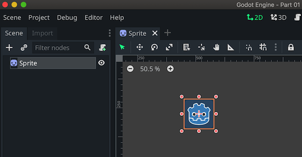
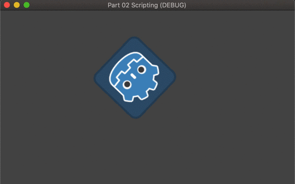

Godot 101 samples @v3.2.2
--------------------------------

@2020/10/17

### Part01 - Intro

> Learn how to create a Godot game project, and add a `Sprite` node to the empty Scene.
> Getting familiar with Godot game engine UI part, setting up `Main Scene` for `Play` button.

Screenshot:

### Part02 - Scripting

> Add script to `Sprite` to make it move and rotate

### Part03 - Scripting continue

### Part04 - Instance Scene

### Part05 - Player Control Sprite

### Part06 - Area Based Collistions

### Part07 - Using Signals

### Part08 - Tweens Timers

### Part09 - Arcade Physics

### Part10 - Raycasts

### Part11 - Animated Sprites

### Part12 - Camera Scrolling Background

### Part13 - Kinematic Body2d Collisions

### Part14 - Intro RigidBody2d

### Part15 - Working RigidBody2d

### ...