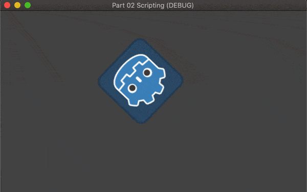

Godot 101 samples @v3.2.2
--------------------------------

@2020/10/17

## FIRST SEASON - 17 EXAMPLES

### Part01 - Intro

> Learn how to create a Godot game project, and add a `Sprite` node to the empty Scene.
> Getting familiar with Godot game engine UI part, setting up `Main Scene` for `Play` button.

Screenshot:

### Part02 - Scripting

> Add gd script file to `Sprite` to make it move and rotate

### Part03 - Scripting continue

> Bouncing sprite with random angle

### Part04 - Instance Scene

> Add 150 sprite scene instances to main scene

### Part05 - Player Control Sprite

> Keyboard controlled Sprite moving in window scale

### Part06 - Area Based Collistions

> Keyborad controlled Alian eating gems

### Part07 - Using Signals

> Counting score by means of the message from gems

### Part08 - Tweens Timers

> Growing and fading effect on gems using tween with counting down mode

### Part09 - Arcade Physics

> Kinematicbody(player) moving on Staticbody(platforms) and dropping

### Part10 - Raycasts

> Player can jump but with restricted jumpping action by Raycast

### Part11 - Animated Sprites

> Player ends up running by turning sprite into animated sprite

### Part12 - Camera Scrolling Background

> Background is moving because there is a camera following player

### Part13 - Kinematic Body2d Collisions

> Bouncing ball with direction arrow

### Part14 - Intro RigidBody2d

> Throw the ball toward the mouse click position, then it hits the slope and sliding

### Part15 - Working RigidBody2d

> Brave aircraft exploring the universe and hitting a unkown planet

### Part 16 - Using the tilemap

> Alien moving down along the platforms made with `TileMap` editor

-----------------------
Above is the first season of godot 101 examples, total is 101 examples...

### more to come, stay tuned ...